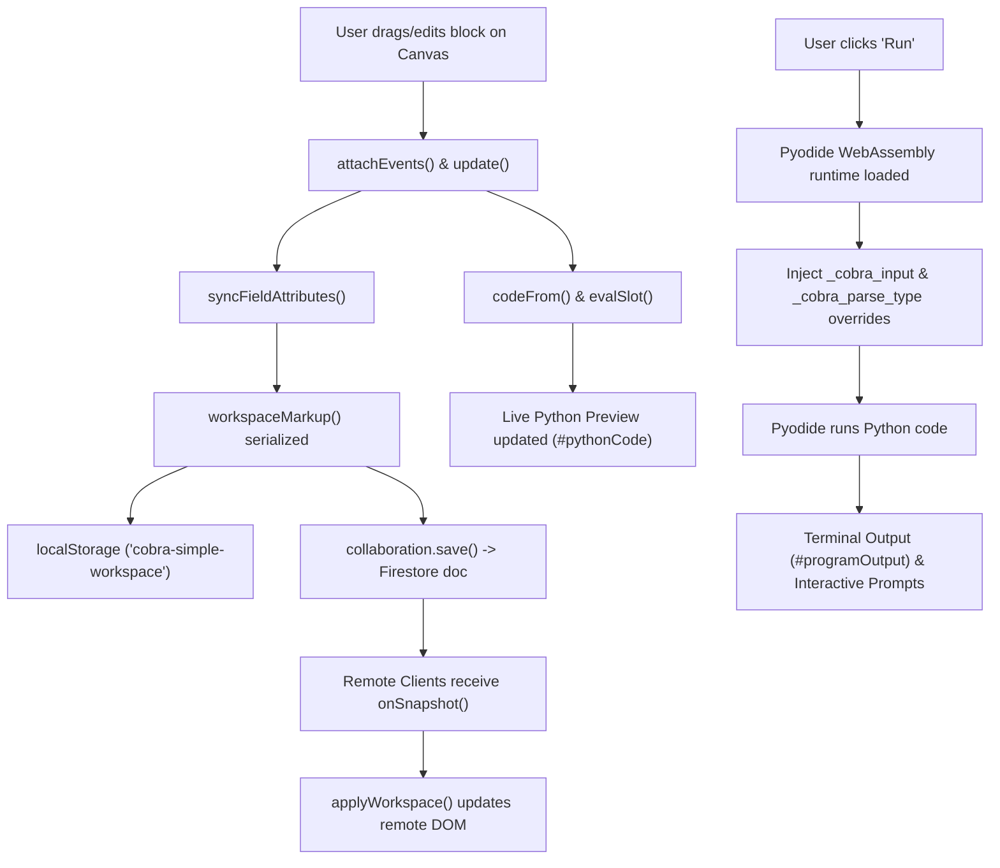

# Cobra — Collaborative Block Python IDE

Cobra is a browser-native, collaborative block-based visual programming environment and Python code generator inspired by Scratch and Snap!. Users can assemble statement and expression blocks, nest math/string/logic operators, write Python interactively, collaborate in real time with remote users, and run Python directly in the browser via WebAssembly.

---

## Key Concepts & Architecture

### 1. Visual Block Paradigm & Scratch/Snap! Nesting
Cobra divides programming constructs into two distinct block types:
- **Statement Blocks**: Vertical blocks (Actions, Logic, Variables) that snap sequentially into stacks (`.stack`). They manage program flow such as loops (`count`, `while`), conditionals (`if`, `if_else`), variable assignments (`set`, `change`), and actions (`print`, `ask`).
- **Reporter / Expression Blocks**: Rounded pill blocks (Operators & Variable values) that plug directly into **Input Slots** (`.input-slot`).
- **Input Slots (`.input-slot`)**: Dual-mode input containers present on statement and operator blocks. An input slot functions as an editable text/number input by default, or accepts nested reporter blocks (e.g. `add`, `subtract`, `multiply`, `divide`, `equals`, `greater`, `join`, `pick random`, `variable score`). Reporter blocks can be nested to arbitrary depths (e.g., `print (score + (level * 10))`).

### 2. Smart Unified `print` Block
Replaces rigid `print_text` and `print_variable` blocks with a single smart `print [slot]` block. The code generator intelligently analyzes the slot content:
- Formats plain text as Python string literals (`print("Hello World")`).
- Passes variable identifiers directly (`print(score)`).
- Formats nested operator expressions (`print((a + b))`).

### 3. DOM State & HTML Attribute Synchronization
To maintain 1-to-1 fidelity across local storage, page refreshes, and multi-user collaboration:
- Live DOM input `.value` properties are continuously synchronized to HTML `value="..."` attributes via `syncFieldAttributes()`.
- Serialized workspace HTML (`workspaceMarkup()`) captures the exact state of all fields and nested reporter structures.
- Workspace upgrades (`upgradeSavedBlocks()`) handle backward-compatible schema migrations without tearing down valid blocks or resetting field values.

---

## Technologies Used

### Frontend Core
- **HTML5 & Semantic Structure**: Pure HTML5 layout with accessible palette groups, category jump navigation, program canvas, Python code viewer, and output terminal panel.
- **Vanilla CSS3 (Design Token Architecture)**:
  - Custom Properties (`--blue`, `--cyan`, `--orange`, `--green`, `--gray`).
  - Flexbox and Grid layouts.
  - Custom dashed drop targets (`.stack`, `.input-slot`, `.slot-drag-over`) and rounded reporter pills (`.block.reporter`).
- **Vanilla JavaScript (ES6+)**:
  - Zero external npm frameworks/build tools required for the UI.
  - HTML5 Drag-and-Drop API (`dragstart`, `dragover`, `dragleave`, `drop`, `dragend`).
  - Event binding tracking using JavaScript `WeakSet` (`eventBound`).

### Python Execution Engine (Pyodide & WebAssembly)
- **Pyodide (v0.26.2)**: CPython compiled to WebAssembly (WASM), running natively inside the browser thread. Loaded dynamically from CDN when the user clicks **Run**.
- **Pyodide JS Bridge (`js` module & `builtins.input` override)**:
  - Custom JS bridge (`window.cobraAskInput`) intercepting standard Python `input()` calls at runtime.
  - When Python hits an `ask` block during execution (even inside `for`/`while` loops or nested `if` statements), execution pauses asynchronously at that line, prompts the user interactively, logs the prompt and answer in real time to the output terminal, and resumes execution.
- **Smart Auto-Type Converter**:
  - Automatically parses input strings into appropriate Python primitives:
    - Digits $\rightarrow$ `int` (e.g. `121`)
    - Decimals $\rightarrow$ `float` (e.g. `3.14`)
    - Booleans $\rightarrow$ `bool` (`True`/`False`)
    - Strings $\rightarrow$ `str`
  - Allows math operators (`+`, `-`, `*`, `/`) and variable changes to execute on user inputs without type mismatch crashes.

### Real-Time Collaboration & Backend (Firebase)
- **Firebase JS SDK (v10.12.2 Compatibility Build)**:
  - `firebase-app-compat.js` (App initialization).
  - `firebase-firestore-compat.js` (Firestore Database).
- **Cloud Firestore**:
  - Real-time document store (`cobraRooms/{roomId}`).
  - Uses `onSnapshot` listeners to broadcast workspace HTML payloads between connected clients instantly.
  - Debounced saving (250ms) to prevent network spamming during fast typing.
- **Firebase Hosting**:
  - Distributed Web CDN for global delivery.
  - Configured with `Cache-Control: no-cache, no-store, must-revalidate` headers in `firebase.json` to guarantee instant deployment updates without stale browser caching.

---

## Pre-Made Assets & Libraries Used

| Asset / Library | Provider / CDN Source | Purpose |
| :--- | :--- | :--- |
| **Pyodide WebAssembly** | `cdn.jsdelivr.net/pyodide/v0.26.2/full/pyodide.js` | Browser-side Python execution engine |
| **Firebase App SDK** | `www.gstatic.com/firebasejs/10.12.2/firebase-app-compat.js` | Firebase project initialization |
| **Firebase Firestore SDK** | `www.gstatic.com/firebasejs/10.12.2/firebase-firestore-compat.js` | Real-time WebSocket workspace database |
| **System Typography** | Browser Native (`Arial`, `Helvetica`, `Consolas`, `Georgia`) | Clean, modern UI & code font rendering |

---

## File Structure

```text
Cobra/
├── index.html                  # Main application UI layout & block palette
├── styles.css                  # UI theme, block styles, input slots & layout
├── app.js                      # Block templates, drag-drop engine, code generator, Pyodide runner
├── collaboration.js            # Firestore room manager & real-time sync
├── firebase-config.js          # Project Firebase API credentials
├── firebase-config.js.template # Config template for version control
├── firebase.json               # Firebase Hosting & Firestore configuration
├── firestore.rules             # Security rules for room collaboration
└── README.md                   # Project documentation
```

---

## System Workflow & Data Flow



---

## How to Run & Deploy

### Running Locally
Open `index.html` directly in any web browser or serve it via a local static file server.

### Deploying to Firebase
1. Install Firebase CLI: `npm install -g firebase-tools`
2. Sign in to Firebase: `firebase login`
3. Deploy hosting & rules:
   ```bash
   firebase deploy
   ```
4. Access live site at `https://cobra-44e9e.web.app` or `https://cobra-44e9e.firebaseapp.com`.
